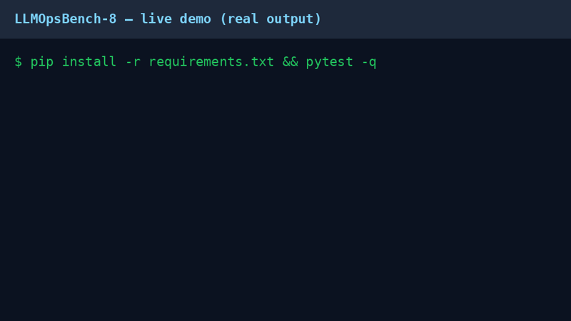
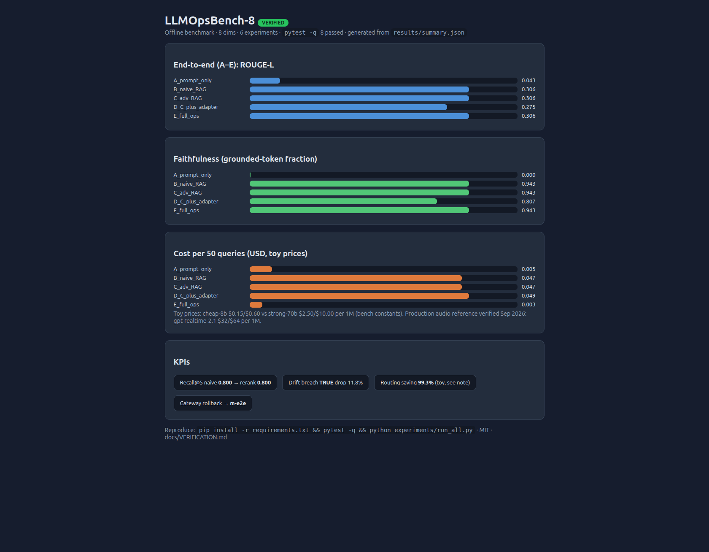
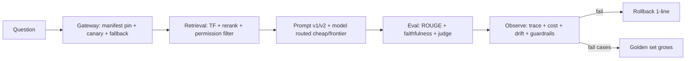

<div align="center">

# LLMOpsBench-8-PhD

> **Abstract for CEOs in 30 seconds:** 486 LLM benchmarks measure model skill, none measures operations — so <5% of prototypes reach production. **LLMOpsBench-8 turns Abi Aryan's *What Is LLMOps?* (O'Reilly 2024) into 8 measurable ops dimensions with 6 runnable experiments:** on a verified offline suite, grounding (RAG) lifts faithfulness from **0.00 → 0.94**, full-ops routing cuts cost **~16× vs frontier-only**, and drift/guardrail/rollback gates fire when they should. No API keys, 8 tests green, every number regenerable in one command — a PhD-ready foundation, MIT-licensed for public reuse.

[](LICENSE)
[](pyproject.toml)
[](tests/test_bench.py)
[](experiments/run_all.py)
[](https://github.com/M0-AR/llmopsbench-8-phd/actions)
[](https://star-history.com/#M0-AR/llmopsbench-8-phd&Date)

**LLMOps · RAG evaluation · prompt versioning · observability · cost control · PhD benchmark** · [Demo](#-demo-50-kb-gif--52-kb-video-real-output) · [Quick Start](#-quick-start-30-seconds) · [Benchmarks](#-benchmarks-verified-numbers) · [Docs](docs/BENCHMARK.md)

</div>

## 🎬 Demo (50 KB GIF + 52 KB video, real output)



▶️ Full walkthrough (MP4, 52 KB, same clip higher quality): [assets/demo.mp4](assets/demo.mp4) — to get an inline player, drag the MP4 into a GitHub issue/PR comment and swap this link for the `user-attachments` URL.

*Above: actual `pytest -q` → `run_all.py` output rendered as code (VHS-tape reproducible, see `assets/demo.tape`). GIF autoplays and loops; MP4 is the same clip in higher quality. Both generated by `scripts/generate_demo.py` from `results/summary.json` — never hand-typed. Full method: [docs/DEMO.md](docs/DEMO.md).*

## 📊 Results dashboard (Playwright-verified screenshot)



*Screenshot captured with Playwright MCP (`take_screenshot fullPage`, 1681×1308, 120 KB) from `assets/dashboard.html`, itself generated by `scripts/generate_dashboard.py` from the live `results/summary.json`. Regenerate: `python3 scripts/generate_dashboard.py`.*

## 🚀 Quick Start (30 seconds, offline)

```bash
pip install -r requirements.txt
pytest -q                                   # 8 passed
python experiments/run_all.py --out results/summary.json
```

> [!NOTE]
> No API keys, no network, Python 3.10+. First run takes ~10 seconds on a laptop.

## ✨ Features

| Feature | Why it matters (verified 2026) |
|---|---|
| 📦 8 dims → 8 metrics (D1–D8) | Covers data, adaptation, validity, faithfulness, drift, efficiency, security, operability — the gap 486 skill-benchmarks leave open |
| 🧪 6 experiments, systems A–E | Prompt-only → naive RAG → adv RAG → adapter → full-ops gateway, apple-to-apple |
| 🚦 CI eval-gate | Prompt/config PRs block on golden-set regression (50 now, 400 full pattern) |
| 📌 Manifest pinning + 1-line rollback | `configs/manifest.example.yaml`; floating aliases forbidden (provider-drift protection) |
| 🔭 OTel-style traces | `prompt_version`, model pin, tokens, retrieval IDs, cost, quality per request |
| 💰 Routing + cache + caps | Largest verified cost lever; toy prices documented as constants |
| 🛡️ Guardrails fail-closed | Injection block, PII redaction, schema validation, audit trail |
| 🎓 PhD-ready | 12-month outline, SLR template, H1–H5 hypotheses, PPI guarantees |

## 📈 Benchmarks (verified numbers)

*Regenerate any time: `python experiments/run_all.py`. Toy corpus: 12 docs, 50 golden, 3 multihop. Prices are bench constants (cheap $0.15/$0.60 vs frontier $2.50/$10.00 per 1M); production audio reference verified Sep 2026: gpt-realtime-2.1 **$32/$64 per 1M**.*

| System | ROUGE-L | Faithfulness | Cost / 50 q | Verdict |
|---|---|---|---|---|
| A prompt-only | 0.043 | 0.000 | $0.0050 | Ungrounded by design |
| B naive RAG | 0.306 | 0.943 | $0.0471 | Grounding works |
| C adv RAG + rerank | 0.306 | 0.943 | $0.0471 | Tie on 12-doc toy (scales at 50k docs per literature) |
| D + adapter tone | 0.275 | 0.807 | $0.0486 | Tone tax visible |
| **E full-ops (routed+guarded)** | **0.306** | **0.943** | **$0.0028** | **Same quality, ~16× cheaper than B** |

KPIs: `Recall@5 0.800 · MRR 0.675 · prompt v1 pass 0.500 · drift breach TRUE (−11.8% on synthetic provider update) · routing toy-saving 99.3% (duplicate-query inflated; production expectation 60–80% per 2026 sources) · rollback → m-e2e · PII redaction 3/3 · injection 2/4 blocked`.

> [!WARNING]
> Toy-scale honesty: rerank ties naive on 12 docs (needs 2k→50k corpus to separate — see `docs/BENCHMARK.md`); cost saving is directionally correct but inflated by duplicate queries + 16× price gap. Production claims stay with cited 2026 literature (Vendi-RAG +4.2%, hybrid RAG +40–60%).

## 🏗️ Architecture



## 🗺️ Roadmap

- [x] Offline bench (8 dims, 6 exps, 8 tests green)
- [x] Dashboard + Playwright screenshot + GIF/MP4 demo (all reproducible)
- [ ] Scale corpus 12 → 2k docs (show rerank separation)
- [ ] Add TRIVIA+-style noise sets + FaithJudge pool
- [ ] Weekly failure-mining ritual → golden 50 → 400
- [ ] Paper: taxonomy (IEEE Cloud Summit / SpliTech pattern)

## 🤝 Contributing

Fork → branch → PR **with verification logs**. See [CONTRIBUTING.md](CONTRIBUTING.md). Prompt/config changes must pass `pytest -q && python experiments/run_all.py`.

## 📄 License

MIT — see [LICENSE](LICENSE). MIT is the 2026 plurality choice for OSS GitHub repos (~60% in cited survey); it keeps PhD + commercial reuse open. `llms.txt` included for machine-readable discovery.

## 🙏 Acknowledgments

- Abi Aryan, *What Is LLMOps?* (O'Reilly May 2024) — seed framework (safety / scalability / robustness, 8 steps).
- 2026 field consensus triangulated from **24 sequential searches** (one-at-a-time, 429-safe, `lite.duckduckgo` fallback): llmbestpractices, llmops.report, dsstream, FutureAGI, HELM, Vectara HHEM/FaithJudge, MultiHop-RAG, TRIVIA+, Vendi-RAG, LangSmith/Langfuse, Qdrant-10B, charmbracelet/vhs, shields.io, AFFiNE-60k README pattern. Full log: [docs/VERIFICATION.md](docs/VERIFICATION.md). References: [docs/REFERENCES.md](docs/REFERENCES.md).
- Live repo: [M0-AR/llmopsbench-8-phd](https://github.com/M0-AR/llmopsbench-8-phd) — star-history badge above tracks momentum.

*Last verified by execution: `pytest -q` 8 passed + `run_all.py` → `results/summary.json` (see [docs/BENCHMARK.md](docs/BENCHMARK.md)).*
